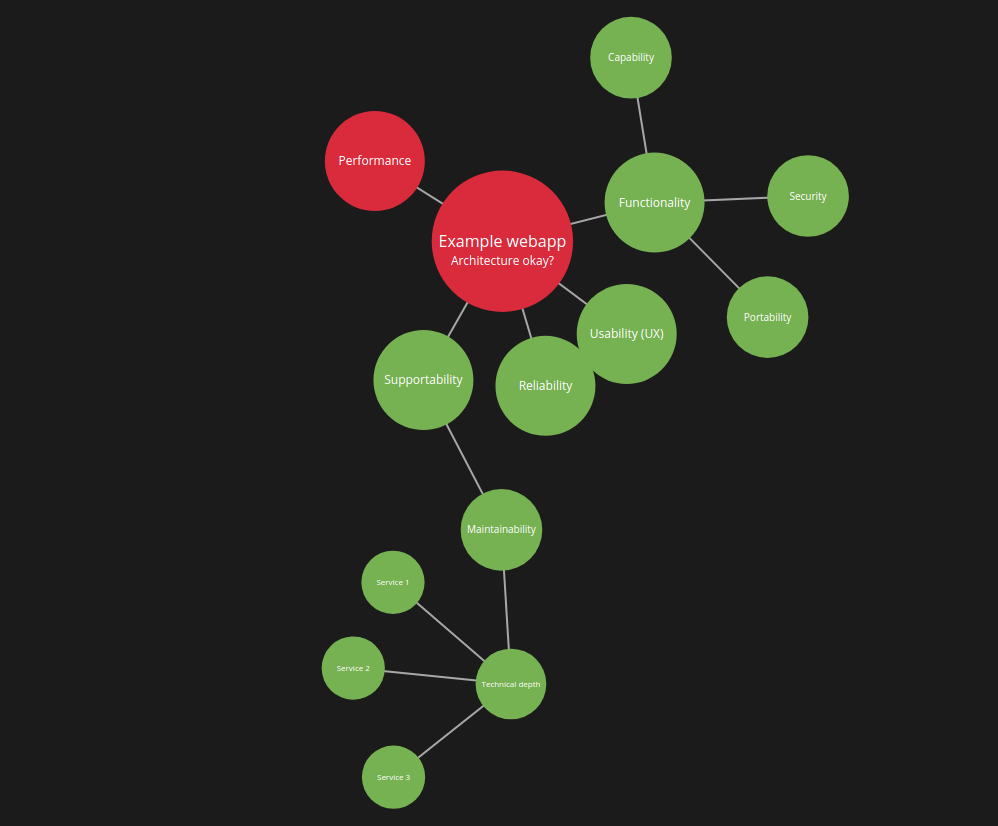

# 3F
Fitness Function Fractalizer

The demo application uses [FURPS](https://en.wikipedia.org/wiki/FURPS) as the first level of fitness functions. FURPS is an acronym representing a 
model for classifying software quality attributes.




## Front-end

The frontend is build with Webpack. To create the project the tool [create-webpack-application](https://www.npmjs.com/package/create-webpack-application) is used.
 
### Developing the front-end
The frontend is build in Javascript and located in the 'src/main/frontend' folder. To start a live webserver and live file reloading, run:

```bash
npm run start
```

To make a build and install it in the Spring boot static resources folder, run:
```bash
npm run build
```
